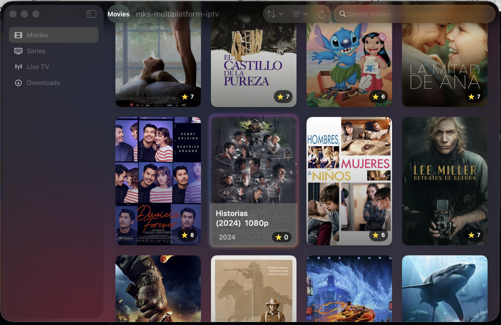

# 🎬 MKS-IPTV-App

[](#) [](#) [](#) [](#) [](#)

## English

A native multiplatform IPTV client built with Swift 6, featuring early adoption of iOS/macOS/tvOS 26 Beta with Liquid Glass design patterns and the latest Apple Human Interface Guidelines.

This application provides comprehensive IPTV streaming capabilities including live TV, video-on-demand (VOD), and advanced download management across Apple's ecosystem.

### Table of Contents
- [English Documentation](#english)
  - [Core Features](#core-features)
  - [Technical Architecture](#technical-architecture) 
  - [Platform Support](#platform-support)
  - [Screenshots](#screenshots-english)
  - [Development Story](#development-story)
  - [Installation](#installation)
  - [Contributing](#contributing)
- [Documentación en Español](#español)

---

## Español

Cliente IPTV nativo multiplataforma desarrollado con Swift 6, implementando las últimas versiones beta de iOS/macOS/tvOS 26 con patrones de diseño Liquid Glass y las Guías de Interfaz Humana más recientes de Apple.

Esta aplicación proporciona capacidades completas de streaming IPTV incluyendo TV en vivo, video bajo demanda (VOD), y gestión avanzada de descargas en todo el ecosistema de Apple.

---

## Core Features

### Live Streaming & VOD
- **Native Live TV Streaming**: Real-time playback using `StreamManager` and `AVPlayer`
- **Advanced Download System**: Local downloads with integrated HTTP server for streaming
- **Smart Stream Management**: 
  - HTTP proxy servers for AVPlayer compatibility
  - Automatic redirect resolution
  - Optimized headers for IPTV services

### Platform Integration
- **iOS 26 Beta Liquid Glass Navigation**: Early implementation of Apple's newest design patterns
- **macOS TouchBar Support**: Native controls for categories, search, and playback
- **Cross-Platform Architecture**: Adaptive navigation across iOS, macOS, and tvOS
- **Apple Ecosystem Optimization**: Enhanced AirPlay integration and Apple TV app compatibility

### Content Management
- **Four Complete Modules**: Movies, Series, Live TV, Downloads with gallery views, search, and filtering
- **Per-Content Actions**:
  - ▶️ Stream live TV (fully functional)
  - 📥 Download with real-time progress tracking
  - 🔗 Open in external players (VLC, IINA, etc.)
  - 📋 Copy direct stream links

### File Format Optimization
- **MOV Conversion**: Automatic conversion to .MOV format for optimal AirPlay and Apple TV integration
- **Metadata Enhancement**: Improved metadata handling for better Apple ecosystem experience
- **Format Compatibility**: MP4 fallback with MOV preferred for Apple devices

---

## Technical Architecture

### Core Technologies
- **Language**: Swift 6.0 with modern concurrency (async/await)
- **Frameworks**: SwiftUI, AVKit, Network framework
- **Architecture**: MVVM with clear separation of concerns
- **Concurrency**: Actor-based concurrency model with structured concurrency

### Platform Support
- **iOS 26 Beta+** (iPhone, iPad) - Liquid Glass design system
- **macOS 26 Beta+** (Intel & Apple Silicon) - TouchBar integration
- **tvOS 26 Beta+** (Apple TV) - Focus-based navigation

### Key Components
- `PlatformNavigationView`: Adaptive cross-platform navigation
- `StreamManager`: Live stream management and URL resolution
- `DownloadManager`: Reactive download system with progress tracking
- `HTTPStreamServer`: Local HTTP server for downloaded content streaming
- `TouchBarManager`: Native macOS TouchBar integration

---

## Screenshots (English)

### macOS Implementation

#### 1. Download Management System

*Advanced download manager showing real-time progress bars, download speeds, file sizes, completion percentages, and ETA calculations. Features pause/resume functionality and queue management.*

#### 2. Download Configuration Modal

*Download configuration interface allowing users to select storage location and enable MOV conversion checkbox. The MOV format conversion enhances AirPlay compatibility and Apple TV integration through improved metadata handling.*

#### 3. Liquid Glass Navigation Implementation

*Early implementation of iOS 26 Beta's Liquid Glass design patterns adapted for macOS, featuring translucent navigation elements and modern visual hierarchy.*

#### 4. Series Detail View

*Comprehensive series information display with episode management, download options, and streaming controls integrated within the Liquid Glass design framework.*

### iOS Screenshots
*iOS screenshots will be available at `./docs/imgs/v0.0.1-alpha/ios/` showcasing iPhone and iPad implementations with native iOS 26 Beta Liquid Glass patterns.*

---

## Development Story

### Personal Learning Journey
This application represents my first comprehensive Swift project, developed as a learning exercise to master Swift 6, SwiftUI, and modern iOS development patterns. The project emerged from a practical need combined with educational curiosity.

### Problem Statement
The existing IPTV client landscape presents several limitations:
- **Commercial solutions** require paid subscriptions
- **Open-source alternatives** often feature outdated, non-native interfaces
- **Cross-platform apps** sacrifice native platform integration
- **Legacy codebases** lack modern Swift concurrency and iOS design patterns

### Reverse Engineering Approach
The core IPTV business logic was developed through **self-taught reverse engineering** of various commercial IPTV services, conducted **strictly for educational purposes**. This process involved:

- Analyzing network traffic patterns from existing commercial IPTV applications
- Understanding IPTV protocol implementations and streaming formats
- Reverse-engineering API endpoints and authentication mechanisms
- Studying optimal streaming configurations for different content types

### Technical Discoveries
Through experimentation and testing, several technical optimizations were discovered:
- **MOV format superiority** over MP4 for AirPlay and Apple TV integration
- **Metadata enhancement techniques** for better Apple ecosystem compatibility
- **HTTP proxy optimization** for AVPlayer streaming compatibility
- **TouchBar integration patterns** for professional macOS applications

### Open Source Philosophy
This project follows the principle: *"If it solves my problem, it might solve others' problems too."* While not claiming to be the definitive IPTV solution, it demonstrates modern Swift development practices and fills a gap in the native Apple ecosystem IPTV client space.

---

## Feature Status

### ✅ **Production Ready**
- [x] **Live TV Streaming**: Real-time playback with native controls
- [x] **Download Management**: Complete download system with progress tracking  
- [x] **Cross-Platform Navigation**: Sidebar (macOS), Split View (iPad), Tab Bar (iPhone)
- [x] **iOS 26 Beta Liquid Glass**: Early implementation of newest design patterns
- [x] **macOS TouchBar Integration**: Native controls for categories, search, and playback
- [x] **Category Management**: Automatic loading and filtering system
- [x] **Real-time Search & Filtering**: Instant search across all content modules
- [x] **HTTP Proxy Infrastructure**: AVPlayer compatibility with IPTV streams
- [x] **External Player Support**: Integration with VLC, IINA, and other players
- [x] **Modern Concurrency**: Swift 6 async/await architecture

### 🔜 **Next Release (v1.1)**
- [ ] **VOD Streaming Integration**: Connect existing infrastructure with UI
- [ ] **Enhanced AirPlay Support**: Real-time MKV transmuxing for AirPlay
- [ ] **Advanced Video Controls**: Native player with enhanced control options
- [ ] **Background Download Support**: Downloads continue when app is backgrounded
- [ ] **Favorites System**: Bookmarking and personalized content lists

### 📋 **Future Roadmap (v1.2+)**
- [ ] **Multiple Playback Engines**: Automatic selection between AVPlayer/VLC/FFmpeg
- [ ] **Offline Playback Mode**: Downloaded content playback without internet
- [ ] **Advanced Content Filtering**: Genre, year, quality, and custom filters
- [ ] **Subtitle Management**: Automatic subtitle detection and integration
- [ ] **tvOS Focus Optimization**: Apple TV-specific UI enhancements

---

## Installation

### Development Requirements
- **Xcode 16 Beta** (for iOS/macOS/tvOS 26 Beta support)
- **macOS 15 Beta+** (development environment)
- **Swift 6.0**
- **Apple Developer Account** (for device installation)

### Build Commands
```bash
# macOS Build
xcodebuild -project mks-multiplatform-iptv.xcodeproj -scheme mks-multiplatform-iptv -configuration Debug

# tvOS Build  
xcodebuild -project mks-multiplatform-iptv.xcodeproj -scheme mks-multiplataforma-tvos-iptv -configuration Debug

# iOS Build (Archive + Export)
xcodebuild -project mks-multiplatform-iptv.xcodeproj -scheme mks-multiplatform-iptv -configuration Release -archivePath build/ios/mks-iptv.xcarchive archive
```

### End User Installation

#### iOS Installation (AltStore Method)
1. Download the .ipa file from [build/ios/mks-multiplatform-iptv.ipa](./build/ios/mks-multiplatform-iptv.ipa)
2. Install using AltStore following the [detailed installation guide](./build/ios/INSTALL-WITH-ALTSTORE.md)
3. Trust the developer certificate in Settings → General → VPN & Device Management

#### macOS Installation
- Download the .app bundle from Releases
- Drag to Applications folder
- Accept "Open application from unidentified developer" prompt

#### tvOS Installation
- Requires Xcode installation with Apple Developer account
- Connect Apple TV via USB-C and deploy through Xcode

---

## Contributing

### Development Guidelines
1. Fork the project repository
2. Create a feature branch: `git checkout -b feature/EnhancementName`
3. Implement changes following Swift 6 and SwiftUI best practices
4. Ensure compatibility with iOS/macOS/tvOS 26 Beta
5. Test across all target platforms
6. Commit changes: `git commit -m 'Add feature: EnhancementName'`
7. Push to branch: `git push origin feature/EnhancementName`
8. Open a Pull Request with detailed description

### Code Standards
- Follow Apple Human Interface Guidelines
- Implement proper Swift 6 concurrency patterns
- Maintain MVVM architecture consistency
- Include comprehensive documentation for new features

---

## Project Structure

```
mks-multiplatform-iptv/
├── IPTVDownloader/
│   ├── Core/                 # Configuration, networking, HTTP servers
│   │   ├── Configuration/    # IPTV service configuration
│   │   ├── Networking/       # HTTP clients and streaming
│   │   └── Player/           # Video player implementations
│   ├── Features/
│   │   ├── Downloads/        # Download system + ViewModels
│   │   ├── LiveChannels/     # Live TV streaming (production ready)
│   │   ├── Movies/           # VOD Movies (UI + backend ready)
│   │   ├── Series/           # VOD Series (UI + backend ready)
│   │   └── TouchBar/         # macOS TouchBar native integration
│   ├── Models/               # Data models (Movie, Series, LiveChannel)
│   ├── Services/             # API services and networking layer
│   └── Utils/                # HTTP servers, streaming utilities
├── mks-multiplataforma-tvos-iptv/  # tvOS-specific target
├── build/
│   └── ios/                  # Distribution builds
└── docs/
    └── imgs/                 # Version-organized screenshots
```

---

## License

This project is licensed under the **GNU General Public License v3.0 (GPL-3.0)**.

This ensures that:
- The source code remains open and accessible
- Modifications and derivatives must also be open source
- Commercial use is permitted under GPL terms
- See [LICENSE](LICENSE) file for complete terms

---

## Contact & Support

- **Developer**: [@mks2508](https://github.com/mks2508)
- **Bug Reports**: [GitHub Issues](https://github.com/mks2508/mks-multiplatform-iptv/issues)
- **Feature Requests**: [GitHub Discussions](https://github.com/mks2508/mks-multiplatform-iptv/discussions)
- **Documentation**: [Project Wiki](https://github.com/mks2508/mks-multiplatform-iptv/wiki)

---

---

# Documentación en Español

Cliente IPTV nativo multiplataforma con soporte completo para las últimas versiones beta de iOS/macOS/tvOS 26, implementando patrones de diseño Liquid Glass y arquitectura Swift 6 moderna.

## Características Principales (Español)

### Streaming y Contenido
- **Streaming de TV en Vivo**: Reproducción nativa con `StreamManager` y `AVPlayer`
- **Sistema de Descargas Avanzado**: Descargas locales con servidor HTTP integrado
- **Gestión Inteligente de Streams**: Servidores proxy HTTP, resolución automática de redirects

### Integración con Plataformas
- **Navegación Liquid Glass iOS 26**: Implementación temprana de los patrones más recientes
- **Soporte TouchBar macOS**: Controles nativos para categorías y reproducción
- **Arquitectura Cross-Platform**: Navegación adaptativa en todas las plataformas Apple

### Optimización de Formatos
- **Conversión MOV**: Conversión automática para mejor integración con AirPlay
- **Mejora de Metadatos**: Manejo optimizado para el ecosistema Apple
- **Compatibilidad de Formatos**: MP4 como respaldo, MOV preferido para dispositivos Apple

## Historia del Desarrollo (Español)

Este proyecto representa mi primera aplicación Swift completa, desarrollada como ejercicio de aprendizaje para dominar Swift 6, SwiftUI y patrones modernos de desarrollo iOS.

### Motivación Personal
La necesidad surgió de las limitaciones encontradas en clientes IPTV existentes:
- Soluciones comerciales requieren suscripciones pagadas
- Alternativas open-source con interfaces desactualizadas y no nativas
- Aplicaciones cross-platform que sacrifican integración nativa
- Bases de código legacy sin concurrencia moderna Swift

### Enfoque de Ingeniería Inversa
La lógica central de IPTV fue desarrollada mediante **ingeniería inversa autodidacta** de varios servicios IPTV comerciales, realizada **estrictamente con fines educativos**:

- Análisis de patrones de tráfico de red
- Comprensión de implementaciones de protocolos IPTV
- Ingeniería inversa de endpoints API y mecanismos de autenticación
- Estudio de configuraciones óptimas de streaming

### Descubrimientos Técnicos
A través de experimentación y pruebas se descubrieron varias optimizaciones:
- **Superioridad del formato MOV** sobre MP4 para integración AirPlay y Apple TV
- **Técnicas de mejora de metadatos** para mejor compatibilidad con el ecosistema Apple
- **Optimización de proxy HTTP** para compatibilidad de streaming AVPlayer

## Estado de Funcionalidades (Español)

### ✅ **Listo para Producción**
- [x] **Streaming TV en Vivo**: Reproducción en tiempo real
- [x] **Gestión de Descargas**: Sistema completo con seguimiento de progreso
- [x] **Navegación Cross-Platform**: Adaptativa para cada plataforma
- [x] **Liquid Glass iOS 26**: Implementación temprana de nuevos patrones
- [x] **Integración TouchBar macOS**: Controles nativos

### 🔜 **Próxima Versión (v1.1)**
- [ ] **Integración Streaming VOD**: Conectar infraestructura existente
- [ ] **Soporte AirPlay Mejorado**: Transmux MKV en tiempo real
- [ ] **Controles de Video Avanzados**: Reproductor nativo mejorado

### 📋 **Roadmap Futuro (v1.2+)**
- [ ] **Múltiples Motores de Reproducción**: Selección automática
- [ ] **Modo Offline**: Reproducción sin conexión
- [ ] **Filtrado Avanzado**: Por género, año, calidad

## Instalación (Español)

### Requisitos de Desarrollo
- **Xcode 16 Beta** (para soporte iOS/macOS/tvOS 26 Beta)
- **macOS 15 Beta+** 
- **Swift 6.0**
- **Apple Developer Account**

### Instalación Usuario Final

#### iOS (Método AltStore)
1. Descargar archivo .ipa desde [build/ios/mks-multiplatform-iptv.ipa](./build/ios/mks-multiplatform-iptv.ipa)
2. Instalar usando AltStore siguiendo la [guía detallada](./build/ios/INSTALL-WITH-ALTSTORE.md)
3. Confiar en certificado de desarrollador

## Screenshots (Español)

### Implementación macOS

#### 1. Sistema de Gestión de Descargas

*Gestor avanzado de descargas mostrando barras de progreso en tiempo real, velocidades de descarga, tamaños de archivo, porcentajes de finalización y cálculos ETA.*

#### 2. Modal de Configuración de Descarga

*Interfaz de configuración permitiendo selección de ubicación de almacenamiento y habilitación de conversión MOV para mejor compatibilidad AirPlay y Apple TV.*

## Licencia (Español)

Este proyecto está licenciado bajo **GNU General Public License v3.0 (GPL-3.0)**, garantizando que el código fuente permanezca abierto y accesible.

## Contacto (Español)

- **Desarrollador**: [@mks2508](https://github.com/mks2508)
- **Reportar Bugs**: [GitHub Issues](https://github.com/mks2508/mks-multiplatform-iptv/issues)
- **Solicitudes de Características**: [GitHub Discussions](https://github.com/mks2508/mks-multiplatform-iptv/discussions)

*Construido con ❤️ usando Swift 6, SwiftUI, y mucho ☕️*
