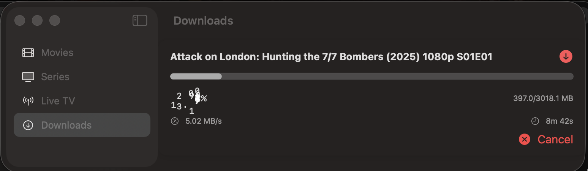
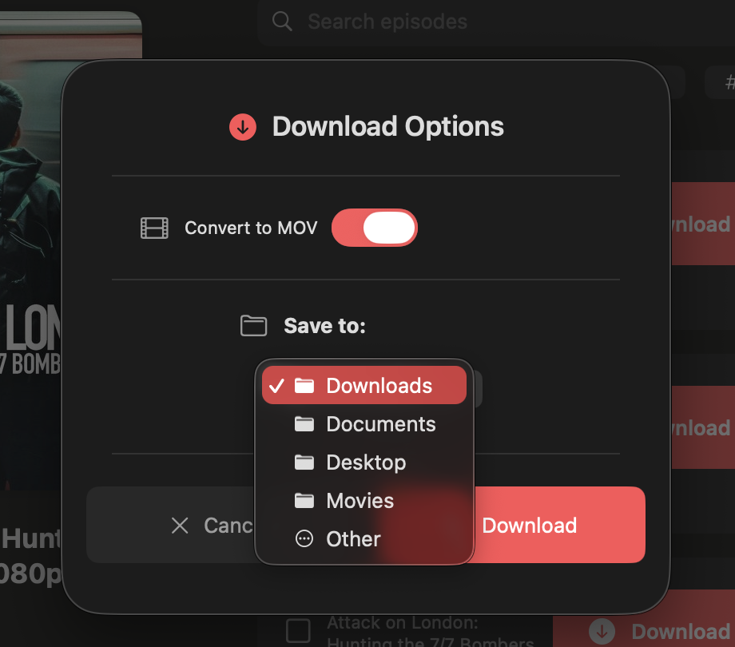

<!-- Professional Three-Stage Hero Section -->
<section class="hero-section immersive-hero">
  <!-- Stage 1: Banner Only (Always Visible) -->
  

    
    

    

  

  
  <!-- Stage 2: Minimal Glass Header (First Scroll) -->
  

    

      

        
        <h1 class="title-minimal">MKS-IPTV-App</h1>
      

    

  

  
  <!-- Stage 3: Progressive Element Reveal (Continued Scroll) -->
  

    <!-- Tagline (Appears First) -->
    

      
The Ultimate IPTV Experience for Apple Devices

    

    
    <!-- Download Button (Appears Second) -->
    

      <a href="download.html" class="btn-download-elegant">
        Download Now
        ⬇
      </a>
    

    
    <!-- Badges (Appear Third) -->
    

      

        

          🚀
          v1.0-beta
        

        

          🍎
          iOS • macOS • tvOS
        

        

          ⚡
          Swift 6.0
        

      

    

    
    <!-- Platform Buttons (Appear Last) -->
    

      

        <a href="#features" class="btn-elegant btn-secondary">
          Explore Features
          ✨
        </a>
        <a href="screenshots.html" class="btn-elegant btn-outline">
          View Screenshots
          📱
        </a>
      

    

  

  
  <!-- Scroll Indicator -->
  

    

      

    

    Scroll to explore
  

</section>

<!-- Screenshot Carousel Section -->
<section class="carousel-section">
  

    

      <h2>See It in Action</h2>
      
Experience the beautiful interface and powerful features

    

    
    

      

        

          

            
            

              <h3>Liquid Glass Design</h3>
              
Modern translucent UI patterns from iOS 26

            

          

          

            
            

              <h3>Advanced Downloads</h3>
              
Real-time progress tracking and queue management

            

          

          

            
            

              <h3>Rich Content Views</h3>
              
Comprehensive series and episode management

            

          

          

            
            

              <h3>Flexible Configuration</h3>
              
Customizable download settings and formats

            

          

        

        
        <!-- Carousel Navigation -->
        <button class="carousel-nav prev" id="carouselPrev" aria-label="Previous screenshot">‹</button>
        <button class="carousel-nav next" id="carouselNext" aria-label="Next screenshot">›</button>
        
        <!-- Carousel Dots -->
        

          <button class="dot active" data-slide="0" aria-label="Screenshot 1"></button>
          <button class="dot" data-slide="1" aria-label="Screenshot 2"></button>
          <button class="dot" data-slide="2" aria-label="Screenshot 3"></button>
          <button class="dot" data-slide="3" aria-label="Screenshot 4"></button>
        

      

    

  

</section>

---

## 🗺️ Quick Navigation

| | |
| :--- | :--- |
| 📥 [**Downloads**](download.html) | Get the latest builds for all platforms. |
| 🛠️ [**Installation Guide**](installation.html) | Step-by-step instructions to get you started. |
| 📸 [**Screenshots**](screenshots.html) | A visual tour of the app's features. |
| 🐙 [**GitHub Repository**](https://github.com/MKS2508/MKS-IPTV-App) | View the project source and contribute. |

---

## ✨ Core Features {#features}

  

    
🍎

    <h3>Native Apple Experience</h3>
    
Built with Swift 6 & SwiftUI for optimal performance and seamless integration with the Apple ecosystem.

  

  
  

    
📺

    <h3>Live TV & VOD</h3>
    
Stream your favorite live channels, movies, and series with adaptive quality and minimal buffering.

  

  
  

    
📥

    <h3>Advanced Downloads</h3>
    
Download content for offline viewing with real-time progress tracking and queue management.

  

  
  

    
🎨

    <h3>Liquid Glass Design</h3>
    
Experience the cutting-edge UI patterns from iOS 26 with beautiful translucency and fluid animations.

  

  
  

    
💻

    <h3>Multi-platform</h3>
    
Works seamlessly across iOS, macOS, and tvOS with platform-specific optimizations.

  

  
  

    
🚀

    <h3>High Performance</h3>
    
Optimized streaming with HTTP proxy servers and hardware acceleration for smooth playback.

  

---

## 💬 Support

Need help? Have a question or a feature request?

- 🐛 [**Report an Issue**](https://github.com/MKS2508/MKS-IPTV-App/issues)
- 💡 [**Start a Discussion**](https://github.com/MKS2508/MKS-IPTV-App/discussions)
- 👨‍💻 [**Contact Developer**](https://github.com/MKS2508)