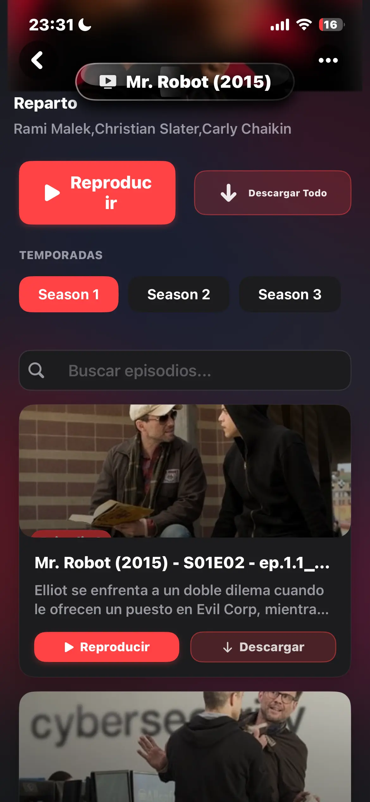
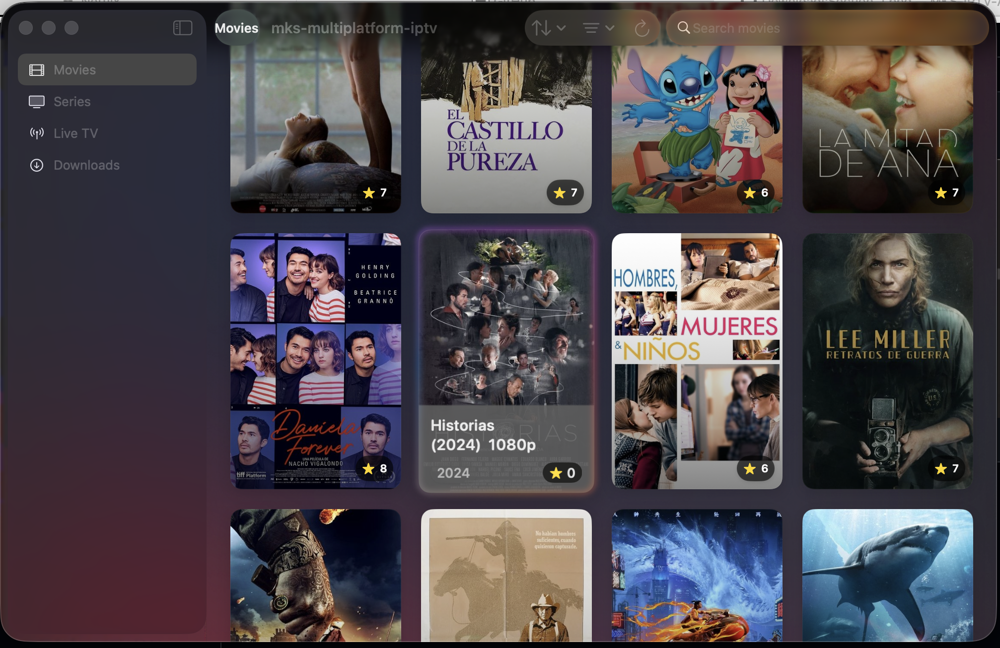
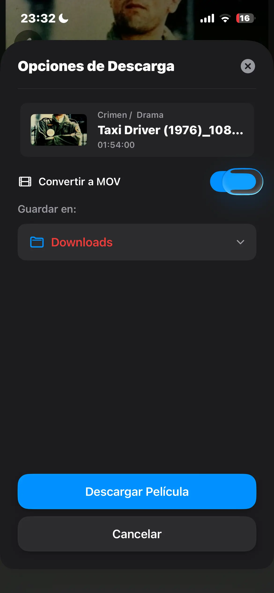
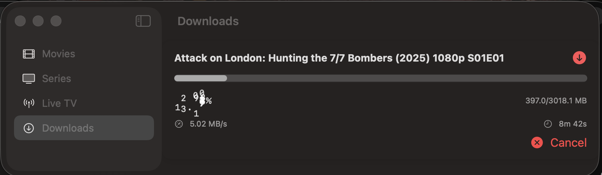

<div align="center">

# 🚀 MKS-IPTV Landing Page


[](https://astro.build/)
[](https://www.typescriptlang.org/)
[](https://tailwindcss.com/)
[](https://bun.sh/)

**Modern landing page para MKS-IPTV-App construido con Astro + TypeScript + Tailwind CSS**

*Migración de Jekyll a Astro con diseño cyberpunk, animaciones GSAP y rendimiento optimizado*

[🎯 Demo Live](https://MKS2508.github.io/MKS-IPTV-App/) • [📚 Documentación](./CLAUDE.md) • [🛠️ Playbook](./PLAYBOOK-ASTRO.md)

---

</div>

## 📱 Vista Previa del Proyecto

<div align="center">


### Screenshots de la Aplicación

<table>
  <tr>
    <td align="center">
      <br>
      <strong>📱 iOS - Detalle de Serie</strong>
    </td>
    <td align="center">
      <br>
      <strong>💻 macOS - Liquid Glass Interface</strong>
    </td>
  </tr>
  <tr>
    <td align="center">
      <br>
      <strong>📱 iOS - Modal de Descarga</strong>
    </td>
    <td align="center">
      <br>
      <strong>💻 macOS - Sección de Descargas</strong>
    </td>
  </tr>
</table>

</div>

---

## 🎯 Características del Proyecto

<div align="center">

| 🎬 **Animaciones** | 📱 **Responsive** | 🚀 **Performance** | 🎨 **Design** |
|:------------------:|:-----------------:|:------------------:|:--------------:|
| GSAP + Lenis | Mobile-First | Static + Islands | Cyberpunk Theme |
| Smooth Scroll | Touch Optimized | Core Web Vitals | Liquid Glass |
| Particle Effects | Cross-Device | Bundle Optimization | Synthwave Colors |

</div>

### ✨ Funcionalidades Principales

- 📱 **App Showcase**: Galería de screenshots y videos demostrativos
- 🎬 **Elementos Interactivos**: Animaciones GSAP, scroll suave, efectos de partículas
- 📸 **Galería de Media**: Screenshots con PhotoSwipe lightbox
- 🚀 **Rendimiento**: Astro static-first con islas para interactividad
- 🎨 **Tema Cyberpunk**: Estética moderna con colores synthwave
- 🔄 **Gestión de Assets**: Sistema centralizado y optimizado

---

## 🏗️ Arquitectura & Metodología

<div align="center">

### 📚 Documentación de Desarrollo

| Documento | Descripción | Enlace |
|:----------|:------------|:-------|
| **📋 General** | Metodología de 3 fases | [`src/PLAYBOOK-GENERAL.md`](src/PLAYBOOK-GENERAL.md) |
| **⚛️ React Patterns** | Atomic design y componentes | [`src/PLAYBOOK-REACT.md`](src/PLAYBOOK-REACT.md) |
| **🚀 Astro Específico** | Patrones adaptados para Astro | [`PLAYBOOK-ASTRO.md`](PLAYBOOK-ASTRO.md) |

</div>

### 🧱 Estructura Obligatoria de Componentes

```bash
components/
└── ComponentName/
    ├── index.astro           # 📄 Componente principal
    ├── styles.ts             # 🎨 Clases Tailwind organizadas (REQUERIDO)
    └── types.ts              # 📝 Interfaces TypeScript (REQUERIDO)
```

### 🎯 Organización Atomic Design

<div align="center">

| Categoría | Descripción | Ejemplos |
|:----------|:------------|:---------|
| **`layout/`** | 🏗️ Estructura de página | Header, Footer, SEO |
| **`sections/`** | 📄 Secciones completas | Hero, Features, Screenshots |
| **`ui/`** | 🧩 Elementos reutilizables | Button, Card, Gallery |
| **`animations/`** | ✨ Componentes GSAP | FadeIn, SlideUp, Parallax |
| **`interactive/`** | 🔄 Islas client-side | Carousel, Lightbox |

</div>

---

## 📁 Estructura del Proyecto

<details>
<summary>📂 <strong>Expandir estructura completa</strong></summary>

```
mks-iptv-landing/
├── 📁 src/
│   ├── 🧩 components/                 # Organización Atomic Design
│   │   ├── layout/                    # Componentes de estructura
│   │   ├── sections/                  # Secciones de página  
│   │   ├── ui/                        # Elementos reutilizables
│   │   ├── animations/                # Componentes GSAP
│   │   └── interactive/               # Componentes client-side
│   ├── 📄 layouts/
│   │   └── Layout.astro               # Layout principal
│   ├── 🌐 pages/
│   │   ├── index.astro                # Homepage
│   │   ├── download.astro             # Página de descarga
│   │   └── screenshots.astro          # Galería de screenshots
│   ├── ⚙️ scripts/                    # Utilidades TypeScript
│   │   ├── gsap-animations.ts         # Configuraciones GSAP
│   │   ├── smooth-scroll.ts           # Setup de Lenis
│   │   └── particles-config.ts        # Config tsParticles
│   ├── 🎨 styles/
│   │   └── globals.css                # Estilos globales
│   ├── 📝 types/
│   │   └── global.d.ts                # Definiciones globales
│   └── 📊 data/                       # Datos estáticos
│       ├── features.ts                # Datos de características
│       ├── screenshots.ts             # Datos de galería
│       ├── downloads.ts               # Enlaces de descarga
│       └── assets.ts                  # Gestión de assets
├── 🌍 public/
│   ├── 🔖 favicon/                    # Favicons (múltiples tamaños)
│   ├── 🖼️ images/                     # Assets organizados
│   │   ├── logos/                     # Logos y branding
│   │   ├── banners/                   # Banners hero y marketing
│   │   ├── frames/                    # Marcos de dispositivos
│   │   └── screenshots/               # Screenshots por plataforma
│   │       ├── ios/                   # Screenshots iOS
│   │       └── macos/                 # Screenshots macOS
│   ├── 🎬 videos/                     # Videos demostrativos
│   └── 📦 files/                      # Descargas (.ipa, .app.zip)
├── 📚 docs/
│   ├── CLAUDE.md                      # Guía específica Claude
│   ├── PLAYBOOK-ASTRO.md              # Patrones de desarrollo
│   ├── current-todos.md               # Tareas actuales
│   └── refactor.astro.md              # Plan técnico
├── ⚙️ config/
│   ├── astro.config.mjs               # Configuración Astro
│   ├── tailwind.config.ts             # Configuración Tailwind
│   ├── tsconfig.json                  # Configuración TypeScript
│   └── package.json                   # Dependencias y scripts
└── 📖 README.md                       # Este archivo
```

</details>

---

## 🧞 Comandos de Desarrollo

<div align="center">

### 🚀 Desarrollo

| Comando | Acción | Descripción |
|:--------|:-------|:------------|
| `bun install` | 📦 Instalar | Instala todas las dependencias |
| `bun dev` | 🔧 Desarrollo | Servidor local en `localhost:4321` |
| `bun build` | 🏗️ Construir | Build de producción en `./dist/` |
| `bun preview` | 👀 Vista previa | Preview del build localmente |

### ✅ Control de Calidad

| Comando | Acción | Descripción |
|:--------|:-------|:------------|
| `bun run check` | 🔍 Verificar | Verificación de tipos Astro |
| `bun run lint` | 🧹 Lint | ESLint + validación TypeScript |
| `bun run format` | 💅 Formatear | Formateo con Prettier |
| `bun run sync` | 🔄 Sincronizar | Sincronizar tipos Astro |

### 🚀 Despliegue

| Comando | Acción | Descripción |
|:--------|:-------|:------------|
| `bun run deploy` | 🌐 Desplegar | Build y deploy a GitHub Pages |

</div>

---

## 📸 Assets & Media

<div align="center">

### 🎨 Organización Visual de Assets

| Tipo | Cantidad | Formatos | Uso |
|:-----|:---------|:---------|:----|
| **🔖 Favicons** | 7 archivos | ICO, PNG, SVG | Iconos del navegador |
| **📋 Logos** | 1 archivo | WebP | Branding principal |
| **🎨 Banners** | 4 archivos | WebP, PNG | Hero y marketing |
| **📱 Frames** | 2 archivos | SVG, PNG | Mockups de dispositivos |
| **🖼️ Screenshots** | 8 archivos | WebP, PNG | Galería por plataforma |
| **🎬 Videos** | 1 archivo | MP4 | Demostraciones |

</div>

### 💡 Uso en Componentes Astro

```astro
---
// 🎨 Importación y uso optimizado de assets
import { Image } from 'astro:assets';
import { logos, banners } from '@/data/assets';
---

<!-- Logo optimizado con carga eager -->
<Image 
  src={logos.appLogo.src}
  alt={logos.appLogo.alt}
  width={logos.appLogo.width}
  height={logos.appLogo.height}
  format="webp"
  loading="eager"
  class="w-30 h-30 object-contain"
/>

<!-- Banner hero con fallback -->
<picture>
  <source srcset={banners.hero.src} type="image/webp">
  
</picture>
```

### 🚀 Optimizaciones de Performance

- ✅ **WebP Primario**: Máxima compresión sin pérdida de calidad
- ✅ **Fallback PNG**: Compatibilidad con navegadores legacy  
- ✅ **Lazy Loading**: Carga diferida para assets no críticos
- ✅ **Responsive**: Múltiples tamaños generados automáticamente
- ✅ **Metadata Rica**: Alt texts y títulos descriptivos

---

## 🎨 Stack Tecnológico

<div align="center">

### 🏗️ Framework Principal

| Tecnología | Versión | Descripción |
|:-----------|:--------|:------------|
| **[Astro](https://astro.build/)** | 5.11 | Generador de sitios estáticos con arquitectura islands |
| **[TypeScript](https://www.typescriptlang.org/)** | 5.8 | Desarrollo type-safe con configuración estricta |
| **[Bun](https://bun.sh/)** | Latest | Package manager y runtime ultra-rápido |
| **[Tailwind CSS](https://tailwindcss.com/)** | 3.4 | Framework CSS utility-first |

### ✨ Animaciones & Interacción

| Librería | Versión | Propósito |
|:---------|:--------|:----------|
| **[GSAP](https://gsap.com/)** | 3.13 | Animaciones profesionales |
| **[Lenis](https://lenis.darkroom.engineering/)** | 1.3.4 | Scroll suave y fluido |
| **[tsParticles](https://particles.js.org/)** | 3.8.1 | Sistema de partículas para fondos |

### 🧩 Componentes UI

| Componente | Versión | Función |
|:-----------|:--------|:--------|
| **[Embla Carousel](https://www.embla-carousel.com/)** | 8.6.0 | Carruseles touch-friendly |
| **[PhotoSwipe](https://photoswipe.com/)** | 5.4.4 | Galería lightbox para imágenes |
| **[Keen Slider](https://keen-slider.io/)** | 6.8.6 | Sliders adicionales |

</div>

---

## 🚀 Inicio Rápido

<div align="center">

### 📋 Prerrequisitos

| Herramienta | Versión | Propósito |
|:------------|:--------|:----------|
| **Bun** | Latest | Runtime principal (recomendado) |
| **Node.js** | v18+ | Compatibilidad alternativa |
| **Git** | Latest | Control de versiones |

</div>

### ⚡ Instalación en 4 Pasos

```bash
# 1️⃣ Navegar al directorio del proyecto
cd /Users/mks/Documents/GitHub/MKS-IPTV-App/docs/mks-iptv-landing

# 2️⃣ Instalar dependencias con Bun
bun install

# 3️⃣ Iniciar servidor de desarrollo
bun dev

# 4️⃣ Abrir en navegador
# 🌐 http://localhost:4321
```

### 🔧 Flujo de Desarrollo

1. **📚 Leer metodología**: Revisar `PLAYBOOK-ASTRO.md` para patrones
2. **🏗️ Seguir estructura**: Todos los componentes deben tener `index.astro`, `styles.ts`, `types.ts`
3. **✅ Verificar calidad**: Ejecutar `bun run check` y `bun run lint` antes de commits
4. **📝 Documentar**: Agregar JSDoc en español a todos los componentes

---

## ⚡ Estándares de Calidad

<div align="center">

### ✅ Definition of Done

**Todo componente debe cumplir estos criterios:**

</div>

| Criterio | Descripción | Verificación |
|:---------|:------------|:-------------|
| **🏗️ Estructura** | `index.astro` + `styles.ts` + `types.ts` | Carpeta del componente |
| **⚙️ Implementación** | Funcional y respeta API definida | Testing manual |
| **🎨 Estilos** | Clases Tailwind en `styles.ts` | Código organizado |
| **📝 Tipos** | Interfaces en `types.ts` | TypeScript check |
| **📱 Responsive** | Mobile, tablet, desktop | Testing visual |
| **♿ Accesibilidad** | ARIA, keyboard, semántica | Audit tools |
| **🚀 Performance** | Core Web Vitals optimizado | Lighthouse |
| **📚 Documentación** | JSDoc en español | Código comentado |
| **🏗️ Build** | Sin errores en verificaciones | CLI commands |
| **👀 Visual** | Correcto en navegador | Testing manual |
| **🔗 Integración** | Compatible con otros componentes | Testing funcional |

### 🎯 Métricas de Calidad

- **TypeScript Strict**: Seguridad de tipos completa
- **ESLint**: Linting y aplicación de estilo
- **Prettier**: Formateo consistente de código
- **Accessibility**: Cumplimiento WCAG y navegación por teclado

---

## 📊 Estado Actual del Proyecto

<div align="center">

### 📈 Progreso de Desarrollo

| Fase | Estado | Progreso | Descripción |
|:-----|:-------|:---------|:------------|
| **Phase 1** | ✅ Completado | 100% | Setup inicial y documentación |
| **Phase 2** | 🚧 En Progreso | 25% | Componentes de layout core |
| **Phase 3** | ⏳ Pendiente | 0% | Sección Hero con GSAP |
| **Phase 4** | ⏳ Pendiente | 0% | Secciones de contenido |

### 🎯 Próximos Pasos

1. **🏗️ Inmediato**: Implementar Header, Footer, SEO, MainLayout
2. **✨ Siguiente**: Sección Hero con animaciones GSAP  
3. **📄 Después**: Secciones Features, Screenshots, Downloads
4. **🚀 Final**: Deployment y optimización

</div>

---

## 📚 Documentación Completa

<div align="center">

### 📖 Documentación del Proyecto

| Documento | Descripción | Enlace |
|:----------|:------------|:-------|
| **🎯 Guía Claude** | Orientación específica para este proyecto | [`CLAUDE.md`](CLAUDE.md) |
| **📋 Tareas Actuales** | Tracking de progreso y tareas | [`current-todos.md`](current-todos.md) |
| **🔧 Plan Técnico** | Implementación completa detallada | [`refactor.astro.md`](refactor.astro.md) |

### 📚 Playbooks de Desarrollo

| Playbook | Enfoque | Enlace |
|:---------|:--------|:-------|
| **🚀 Astro Específico** | Patrones y guidelines para Astro | [`PLAYBOOK-ASTRO.md`](PLAYBOOK-ASTRO.md) |
| **📋 Metodología General** | Desarrollo de software general | [`src/PLAYBOOK-GENERAL.md`](src/PLAYBOOK-GENERAL.md) |
| **⚛️ Patrones React** | Atomic design y componentes | [`src/PLAYBOOK-REACT.md`](src/PLAYBOOK-REACT.md) |

### 🌐 Referencias Externas

| Recurso | Descripción | Enlace |
|:--------|:------------|:-------|
| **📖 Astro Docs** | Documentación oficial de Astro | [docs.astro.build](https://docs.astro.build/) |
| **📝 TypeScript Guide** | Integración TypeScript en Astro | [TypeScript en Astro](https://docs.astro.build/en/guides/typescript/) |
| **🎨 Tailwind CSS** | Referencia de clases utility | [tailwindcss.com/docs](https://tailwindcss.com/docs) |

</div>

---

## 🔗 Integración del Proyecto

<div align="center">

**Este landing page forma parte del ecosistema MKS-IPTV-App:**

| Componente | Descripción | Ubicación |
|:-----------|:------------|:----------|
| **📂 Repositorio Principal** | Documentación y build artifacts | `/Users/mks/Documents/GitHub/MKS-IPTV-App` |
| **🌐 Sitio de Documentación** | GitHub Pages deployment | [MKS2508.github.io/MKS-IPTV-App](https://MKS2508.github.io/MKS-IPTV-App/) |
| **🚀 Deployment** | GitHub Actions automatizado | GitHub Pages |
| **📦 Build Artifacts** | Archivos .ipa y .app.zip | Repositorio principal |

</div>

---

## 🤝 Contribuir al Proyecto

### 📋 Guías para Contribuidores

1. **📚 Seguir los playbooks**: Adherirse a patrones en `PLAYBOOK-ASTRO.md`
2. **🏗️ Usar estructura obligatoria**: Cada componente necesita la estructura de 3 archivos
3. **📝 Documentar todo**: JSDoc en español para todos los componentes
4. **🧪 Testing exhaustivo**: Ejecutar verificaciones de calidad antes de commits
5. **✅ Completar Definition of Done**: Cumplir todos los items del checklist

### 🔧 Proceso de Desarrollo

```bash
# 🌿 Crear rama de feature
git checkout -b feature/nombre-descriptivo

# 💻 Desarrollar siguiendo PLAYBOOK-ASTRO.md
# ✅ Verificar calidad
bun run check && bun run lint

# 📝 Commit con Conventional Commits
git commit -m "feat(componente): descripción del cambio"

# 🚀 Push y crear PR
git push origin feature/nombre-descriptivo
```

---

<div align="center">

## 📄 Licencia

**Este proyecto está licenciado bajo GPL-3.0**

Ver el repositorio principal para detalles completos de la licencia.

---


**MKS-IPTV Landing Page** - Construido con ❤️ usando Astro, TypeScript y Tailwind CSS

[⬆️ Volver al inicio](#-mks-iptv-landing-page)

</div>