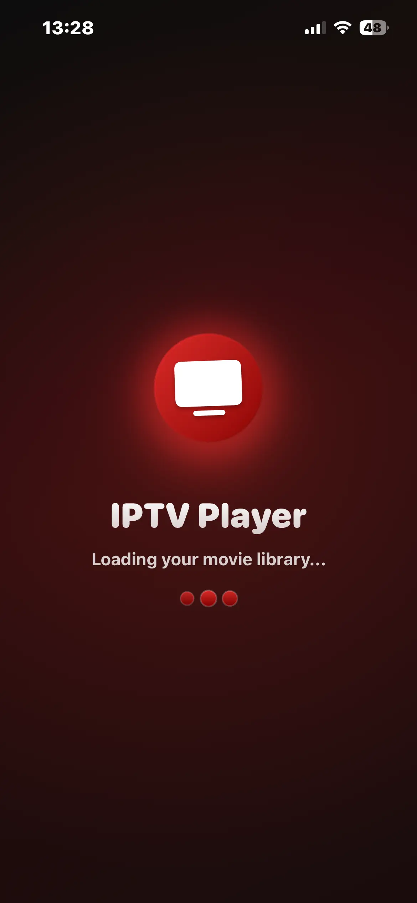
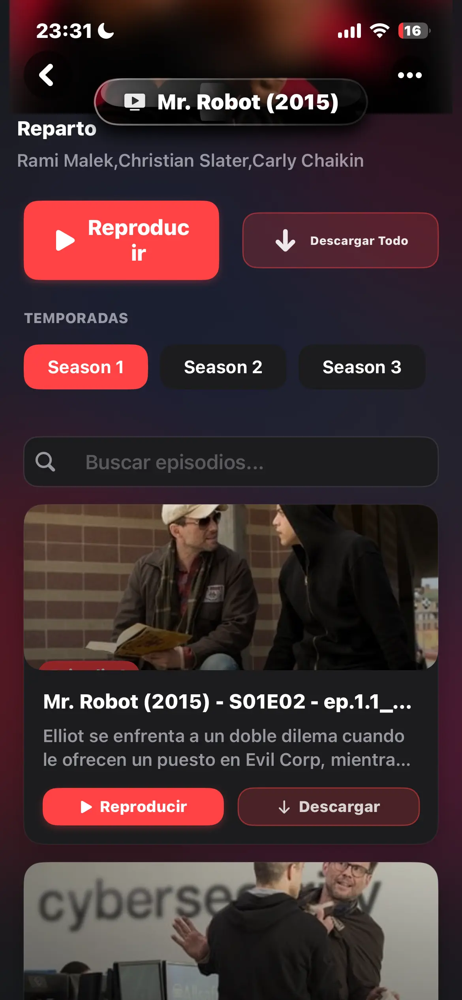
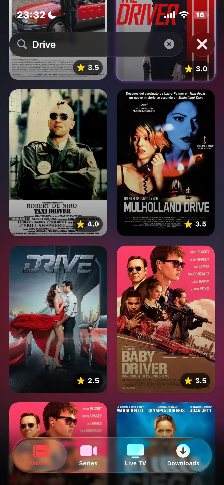
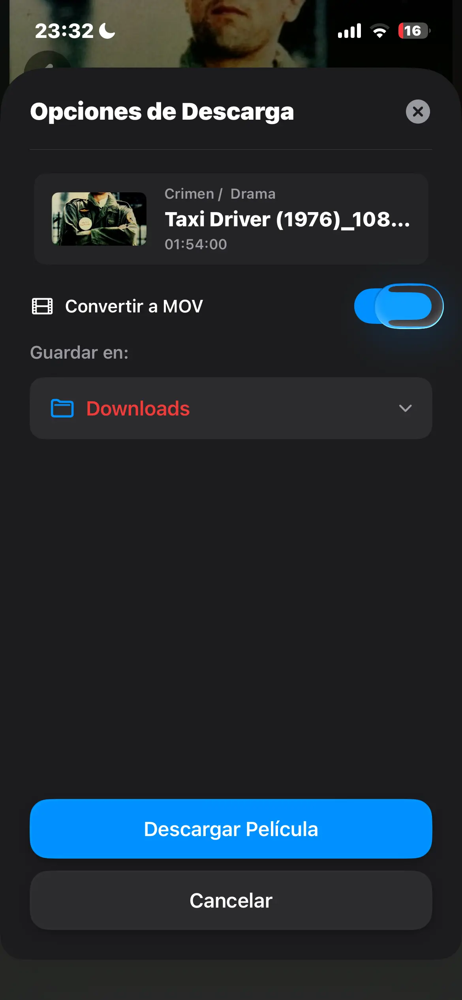

# 📸 Screenshots Gallery

A visual tour of MKS-IPTV-App across its supported platforms. Experience the beautiful interface and powerful features through these screenshots from the `v1.0-beta` release.

<!-- Platform Tabs -->

  <button class="tab-btn active" data-platform="macos">
    💻
    macOS
  </button>
  <button class="tab-btn" data-platform="ios">
    📱
    iOS
  </button>
  <button class="tab-btn" data-platform="tvos">
    📺
    tvOS
  </button>

<!-- Platform Content -->

  

    <h2>macOS Implementation</h2>
    
Showcase of the application running on macOS 26 Beta, highlighting the Liquid Glass design and key features.

  

  
  

    

      <figure class="gallery-item macos-horizontal">
        
        <figcaption>
          <h3>Liquid Glass Navigation</h3>
          
Modern translucent UI patterns from iOS 26, adapted for macOS with native window controls.

        </figcaption>
      </figure>
      
      <figure class="gallery-item macos-horizontal">
        
        <figcaption>
          <h3>Download Management</h3>
          
Real-time progress tracking with speed, ETA, and status for all your downloads.

        </figcaption>
      </figure>
      
      <figure class="gallery-item macos-horizontal">
        
        <figcaption>
          <h3>Download Configuration</h3>
          
Configure storage location and enable .MOV conversion for better AirPlay compatibility.

        </figcaption>
      </figure>
      
      <figure class="gallery-item macos-horizontal">
        
        <figcaption>
          <h3>Series Detail View</h3>
          
Comprehensive series information with episode management and download options.

        </figcaption>
      </figure>
    

  

  

    <h2>iOS & iPadOS</h2>
    
Native iOS 26 Beta implementation with Liquid Glass patterns optimized for iPhone and iPad.

  

  
  

    

      <figure class="gallery-item ios-vertical">
        

          
          

        

        <figcaption>
          <h3>Loading Screen</h3>
          
The initial loading experience with a clean and modern design.

        </figcaption>
      </figure>
      
      <figure class="gallery-item ios-vertical">
        

          
          

        

        <figcaption>
          <h3>Series Detail View</h3>
          
Detailed view of a series with episode information and playback options.

        </figcaption>
      </figure>
      
      <figure class="gallery-item ios-vertical">
        

          
          

        

        <figcaption>
          <h3>Series List Search</h3>
          
Efficient search functionality within the series list for quick content discovery.

        </figcaption>
      </figure>
      
      <figure class="gallery-item ios-vertical">
        

          
          

        

        <figcaption>
          <h3>Download Modal</h3>
          
Modal for managing downloads, including quality and storage options.

        </figcaption>
      </figure>
      <figure class="gallery-item ios-vertical">
        

          <video class="screenshot-content" controls autoplay loop muted playsinline>
            <source src="./imgs/v0.0.1-alpha/ios/ios full demo.MP4" type="video/mp4">
            Your browser does not support the video tag.
          </video>
          

        

        <figcaption>
          <h3>Full Demo Video</h3>
          
A complete demonstration of the iOS application's features and user experience.

        </figcaption>
      </figure>
    

  

  

    <h2>Apple TV (tvOS)</h2>
    
Focus-based navigation optimized for the living room experience on Apple TV.

  

  
  

    

      <figure class="gallery-item tvos-horizontal">
        
        <figcaption>
          <h3>tvOS Interface</h3>
          
A sleek and intuitive interface designed for the big screen.

        </figcaption>
      </figure>
      
      <figure class="gallery-item tvos-horizontal">
        
        <figcaption>
          <h3>Content Browsing</h3>
          
Easy navigation through your favorite shows and movies.

        </figcaption>
      </figure>
    

  

