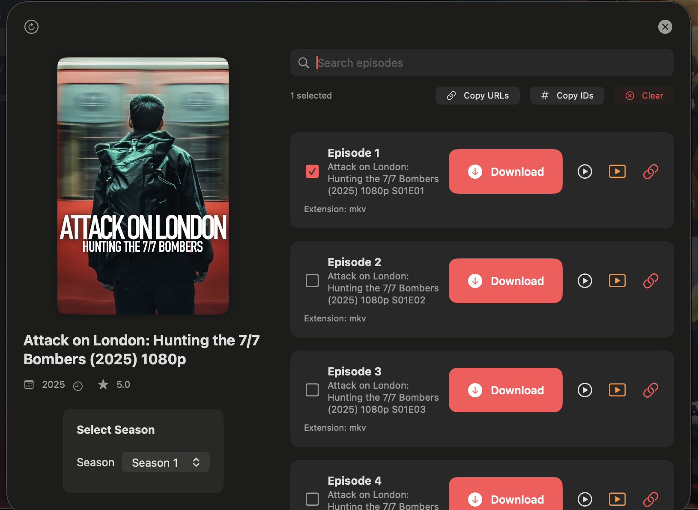

# 📸 Screenshots Gallery

A visual tour of MKS-IPTV-App across its supported platforms. These screenshots are from the `v1.0-beta` release.

---

## 💻 macOS Implementation

Here is a showcase of the application running on macOS 26 Beta, highlighting key features and the Liquid Glass design.

| Download Management System | Download Configuration Modal |
| :---: | :---: |
|  |  |
| **Liquid Glass Navigation** | **Series Detail View** |
|  |  |

### Feature Descriptions

*   **Download Management System**: Shows real-time progress, speed, ETA, and status for all your downloads.
*   **Download Configuration Modal**: Allows you to select storage location and enable `.MOV` conversion for better AirPlay compatibility.
*   **Liquid Glass Navigation**: An early adoption of iOS 26's translucent and modern design patterns, adapted for macOS.
*   **Series Detail View**: Displays comprehensive series information, episode management, and download options.

---

## 📱 iOS & iPadOS (Coming Soon)

Screenshots showcasing the native iOS 26 Beta Liquid Glass patterns on both iPhone and iPad are in progress. They will be available in the `docs/imgs/v0.0.1-alpha/ios/` directory soon.

**Planned views:**
- Home Screen with Tab Bar Navigation
- Live TV Player Interface
- iPad Split View for Multitasking

---

## 📺 tvOS (Coming Soon)

Apple TV screenshots will be added to demonstrate the focus-based navigation and living-room-optimized user experience.
